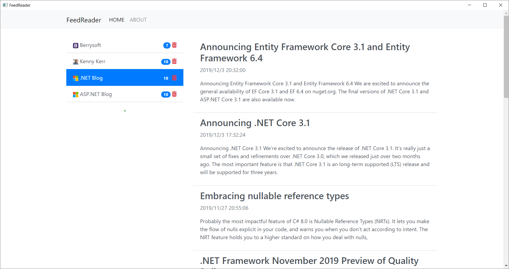

# FeedReader

A Blazor Atom/RSS reader, build upon [WebWindow](https://github.com/SteveSandersonMS/WebWindow/).

It only stores the needed infomation of the feed. You read the posts in *real* browsers.

## Screenshot

